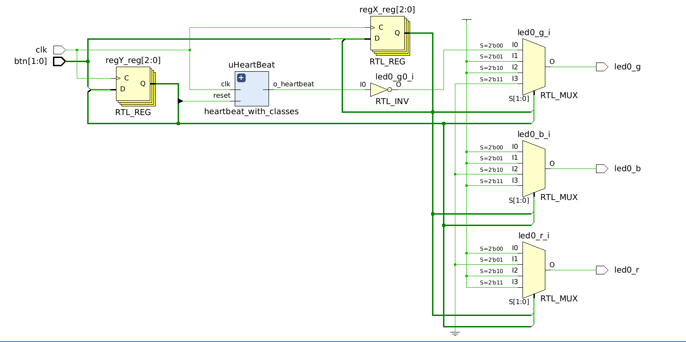

# VeCheck
*Checking* SystemVerilog IEEE-2023 synthesis capabilities and providing example synthesizable designs.  

# Introduction
The focus of this repository is on the synthesizable features
of SystemVerilog, where these features are often the evolving or advanced aspects of the language.

Knowing what features of SystemVerilog are supported for synthesis
is key to writing code that works and does not present a problem 
late in the development cycle. 

To this end, this repository goes directly to synthesis to verify the language constructs. The design target a low cost development board. While simulation is a primary aspect of FPGA development, verification
with fully synthesized code is the only concrete answer as to the
support of a given language feature.


# Testing Features

The various advanced features are evaluated for IEEE 1800-2017 and 1800-2023. A relevant design guide is AMD UG901 document.

The features below will be tested in a top_level file, and 
various modules will be referenced corresponding to each
category. Overall the approach is to have a single top_level
file in which one case each feature tested. 

Feature | Description | Passing
---------|----------|---------
classes | use of classes, wrapped in a package | passing
types | passing parameters as types | passing
fixed point format | use of bit[I:-Q] or logic[I:-Q] | passing
tbd | new features of 1800-2023 | 

## Classes and Types

A particular interest is clases, allowing for more Object Oriented Programming (OOP)
approach for **synthesis** with SystemVerilog. The AMD user guide UG901 advertises support classes, and this repository is a test platform for those features.

One advantage of classes is encapsulating code that handles
bit widths as shown by the $clog2 function in the resolution
of the data types uT and dT. 

### Example Class Usage

Consider the implementation of a heartbeat counter shown below
comprised of an up counter for the frame, and a down counter
for the duty cycle. These counters are implementing by
referencing the class object from the package CounterPkg. 

The handling of data types with 
the localparams uT and dT are local to the class and allow
for great flexibility when instantiating the class, and the 
designer does not have to repeat this type of code in the higher
level module instantiation. Note that there are **functional** 
programming aspect to handling the counters. 

```Verilog
module heartbeat_with_classes(
    input  bit clk, 
    input  bit reset, 
    output bit o_heartbeat
);
    
localparam types::u32 Modulo = 12_000_000;
localparam types::u32 Duty   =  2_400_000;

localparam type uT = bit[$clog2(Modulo)-1:0];
localparam type dT = bit[$clog2(Duty)-1:0];

CounterPkg::UpCount #(.T(uT),.Modulo(Modulo)) frame_counter;
CounterPkg::DnCount #(.T(dT),.Modulo(Duty)) duty_counter;

always_ff@(posedge clk) begin 
  if (reset) begin 
    frame_counter.clear();
    duty_counter.clear();
  end
  else begin 
    frame_counter.increment();
    if (frame_counter.flag) begin
        frame_counter.clear();
        duty_counter.load(Duty);
    end 
    if (duty_counter.value) duty_counter.decrement();
  end 
end  

assign o_heartbeat = (duty_counter.value);

endmodule
```
### Wrapping Classes in a Package

The code below shows how the UpCount class was wrapped in package
called CounterPkg. This allows for the code above to work. 

The upstream module can import with import CounterPkg::*, or one
can use local bindings such as CounterPkg::UpCount() as in the code above. 

```Verilog
package CounterPkg; 

class UpCount #(parameter type T, parameter T Modulo = 0); 

static T value;
static bit flag; 
static T modulo = 0;

function new();
  this.value = 0;
  this.modulo = Modulo;
endfunction

function void clear();
  this.value = 0;
endfunction 

function void load(T load_value);
  this.value = load_value;
endfunction 

function void increment();
  this.value++;
  this.flag = (this.value == this.modulo);
endfunction

endclass

endpackage 
```


# Validation

For this repsitory, validating the example design is done by 
targeting the Digilent CMODS7 board, as it is a low cost small
form factor board that is generally available. 

Steps to duplicate the design results : 

```bash
git clone https://git@github.com/saturn77/VeCheck.git
```

The open Vivado and create a new project, adding the source
files and constraint files in the repos. Upon RTL elaboration,
the block diagram below should be displayed. 




