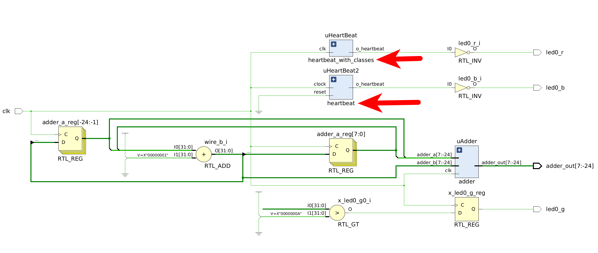

# VeCheck
*Checking* **SystemVerilog IEEE-2023 and IEEE-2017 synthesis capabilities** and providing example designs.  

# Introduction
The features of SystemVerilog for synthesis are the focus, where 
example projects are built to evaluate various features of the language.The documentation guides from vendors are often vague, so specific 
examples are needed to validate the advertised language aspects. 

## Standards 

SystemVerilog is an IEEE standard; the two most recent standards being
IEEE 1800-2017 and IEEE 1800-2023. The use of Verilator is made to make the features widely available for evaluation versus close source simulators. 

# Features

The various features are evaluated 

Feature | Descriptioin | Passing
---------|----------|---------
 fixed point format | use of bit[I:-Q] or logic[I:-Q] | passing
 classes | use of classes, wrapped in a package | passing
 types | passing parameters as types | passing
tbd | new features of 1800-2023 | 
## Classes

A particular interest is clases, allowing for more Object Oriented Programming (OOP)
approach for **synthesis** with SystemVerilog. 




whereas two basic modules were compared

1. Normal SystemVerilog
2. SystemVerilog with classes

The heartbeat module synthesized with normal SystemVerilog is here:


Now the heartbeat module synthesized with the class is as below : 


# SystemVerilog with Classes

Now how to implement a synthesizable SystemVerilog class? For Vivado, the class was wrapped in a package and the code is shown below. 

Note the use of passing parameters at types. 


```Verilog
package CounterPkg; 

class UpCount #(parameter type T, parameter T Modulo = 0); 

static T value;
static bit flag; 

function new();
this.value = 0;
endfunction

function clear ();
    this.value = 0;
endfunction 

function load (T load_value);
    this.value = load_value;
endfunction 

function increment ();
   this.value = this.value + 1;
   this.flag = (this.value == Modulo) ? 1'b1 : 1'b0;
endfunction

endclass

class DnCount #(parameter type T, parameter T Modulo = 0); 

static T value;
static bit flag; 

function new();
this.value = Modulo;
endfunction

function clear ();
    this.value = 0;
endfunction 

function load (T load_value);
    this.value = load_value;
endfunction 

function decrement ();
   this.value = this.value - 1;
   this.flag = (this.value) ? 1'b1 : 1'b0;
endfunction

endclass

endpackage 

```


# Validation

The project is currently synthesized for Digilent CMOD-S7 devices,
and there is a constraint file available if you want to build your
own version. 

